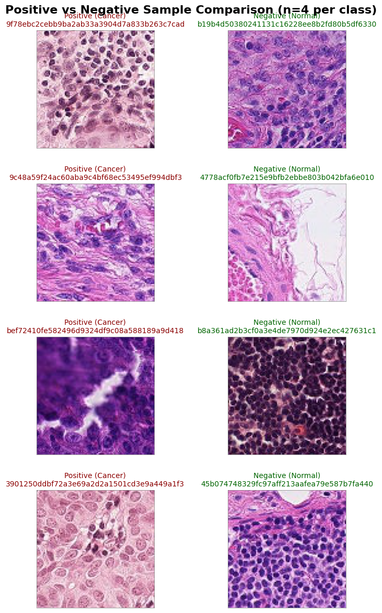
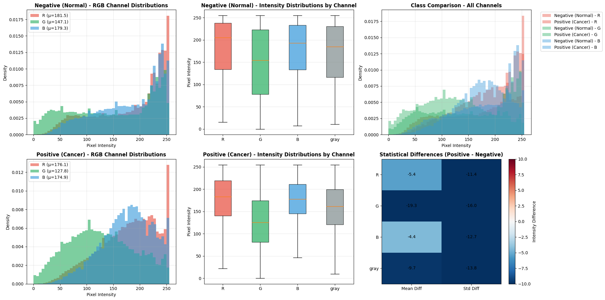

# Histopathologic Cancer Detection

Detecting metastatic cancer in digital pathology image patches with a convolutional neural network whose architecture and optimizer are selected by Bayesian hyperparameter search.


## Overview

This project tackles the [Kaggle Histopathologic Cancer Detection](https://www.kaggle.com/competitions/histopathologic-cancer-detection) challenge, built on the [PatchCamelyon (PCam)](https://github.com/basveeling/pcam) benchmark. Each sample is a 96×96 RGB patch extracted from a whole-slide scan of lymph node tissue; a patch is labeled **positive** if the *center 32×32 region* contains at least one pixel of tumor tissue.

The full analysis lives in a single annotated notebook: [`notebooks/histopathologic-cancer-detection.ipynb`](notebooks/histopathologic-cancer-detection.ipynb). It covers:

1. **Exploratory data analysis** — label balance, structural validation of the images, visual inspection, artifact screening, and per-channel pixel-intensity analysis.
2. **Modeling** — a family of small VGG-style CNNs searched with KerasTuner's Bayesian optimization over both architecture (crop size, depth, filters, batch norm) and training configuration (optimizer, learning rate, dropout, label smoothing).
3. **Results & discussion** — an honest read of what worked, what broke, and what comes next.

<p align="center">
  
</p>

## Dataset

| | |
|---|---|
| Training patches | 220,025 (89,117 positive / 130,908 negative — ≈40.5% / 59.5%) |
| Test patches | 57,458 |
| Patch size | 96 × 96 × 3 (`.tif`) |
| Labeling rule | Positive ⇔ tumor tissue present in the center 32×32 px |
| Source | Kaggle competition data (deduplicated subset of PCam), derived from the Camelyon16 challenge |

The images (~7 GB) are not stored in this repository — see [`data/README.md`](data/README.md) for download instructions.

## Key EDA findings

- **Data integrity holds up.** A 3,000-image random sample was 100% readable and exactly 96×96×3 — no resizing or corruption handling needed.
- **Degenerate patches are rare and skew negative.** A variance-based screen over 10,000 patches found only 33 (≈0.3%) near-monochromatic images (28 white slide background, 5 dark), 31 of which are negatives — a blank patch can't contain tumor in its center.
- **Staining density is real signal.** Positive patches are systematically darker and less variable, with the largest class gap in the **green channel** (mean difference ≈ −19 intensity levels) — consistent with hematoxylin-stained nuclei in densely cellular tumor tissue absorbing strongly in green.

<p align="center">
  
</p>

## Modeling approach

Instead of hand-picking one architecture, the notebook defines a search space of small CNNs and lets **Bayesian optimization (16 trials)** choose:

| Group | Hyperparameters searched |
|---|---|
| Input | center-crop size (32–96 px) — motivated by the center-32×32 labeling rule |
| Conv stack | 1–3 blocks, 1–3 convs per block, 16–64 initial filters, 1.25–2× filter growth, batch norm on/off |
| Head | 128–256 dense units, 0.4–0.8 dropout |
| Loss / optimizer | label smoothing, Adam vs. RMSprop, learning rate, momentum terms |

Training uses histopathology-appropriate augmentation (free 90° rotations and flips are label-preserving since patches have no canonical orientation, plus mild brightness/zoom jitter) on a stratified 67/33 train/validation split.

## Results

| Metric | Value |
|---|---|
| Best validation AUC (hyperparameter search, 16 trials) | **0.869** |
| Training AUC / accuracy (extended training, epoch 7) | 0.905 / 0.835 |

**Known issue, diagnosed in the notebook:** during extended training of the tuner's best model, validation metrics collapse (AUC pinned at 0.5, exploding validation loss) while training metrics keep improving — a signature of a broken evaluation path rather than a model that can't learn. The leading suspects are mis-estimated batch-norm inference statistics and the fragility of continuing `fit()` on a tuner-returned model instead of rebuilding from the best hyperparameters and retraining from scratch. The notebook's final section walks through the evidence and the fix.

## Repository structure

| Path | Purpose |
|---|---|
| [`notebooks/histopathologic-cancer-detection.ipynb`](notebooks/histopathologic-cancer-detection.ipynb) | Full annotated analysis: EDA → model search → training → discussion |
| [`figures/`](figures/) | Key visualizations exported from the notebook |
| [`data/`](data/) | Dataset location (gitignored; download instructions inside) |
| [`requirements.txt`](requirements.txt) | Python dependencies |

## Reproducing

The notebook was developed on Kaggle, where the dataset is mounted automatically:

1. Open the [competition page](https://www.kaggle.com/competitions/histopathologic-cancer-detection) → *Code* → *New Notebook*, and upload the notebook, or
2. Run locally:

```bash
git clone https://github.com/chernobylx/Histopathological-Cancer-Detection.git
cd Histopathological-Cancer-Detection
pip install -r requirements.txt

# download the data (requires the Kaggle CLI and accepting the competition rules)
kaggle competitions download -c histopathologic-cancer-detection -p data/
unzip -q data/histopathologic-cancer-detection.zip -d data/histopathologic-cancer-detection

jupyter lab notebooks/histopathologic-cancer-detection.ipynb
```

When running locally, point the data path in section 2.1 of the notebook at `data/histopathologic-cancer-detection` instead of `/kaggle/input/histopathologic-cancer-detection`. A GPU is strongly recommended — the 16-trial search took ~3 hours on a Kaggle GPU.

## Roadmap

- [ ] Rebuild the best model from its hyperparameters and retrain from scratch with full validation passes
- [ ] Migrate the input pipeline from the deprecated `ImageDataGenerator` to `tf.data`
- [ ] Benchmark against an ImageNet-pretrained backbone (ResNet / EfficientNet)
- [ ] Generate test-set predictions and submit for a leaderboard score

## Acknowledgments

- Dataset: [PatchCamelyon](https://github.com/basveeling/pcam) (Veeling et al., 2018), derived from the Camelyon16 challenge (Ehteshami Bejnordi et al., 2017), via Kaggle.
- Some visualization utilities in the notebook were drafted with LLM assistance, as noted inline.
